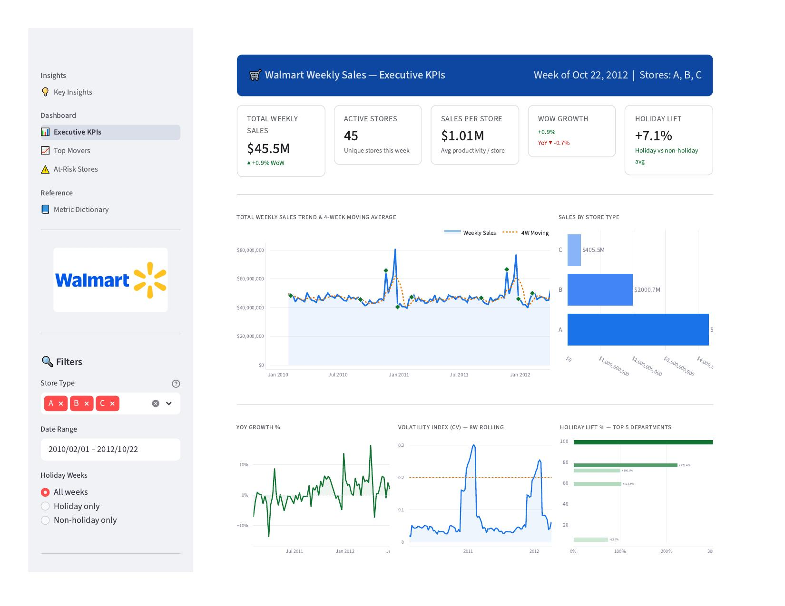
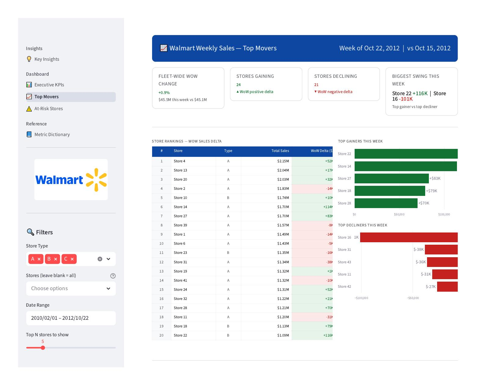
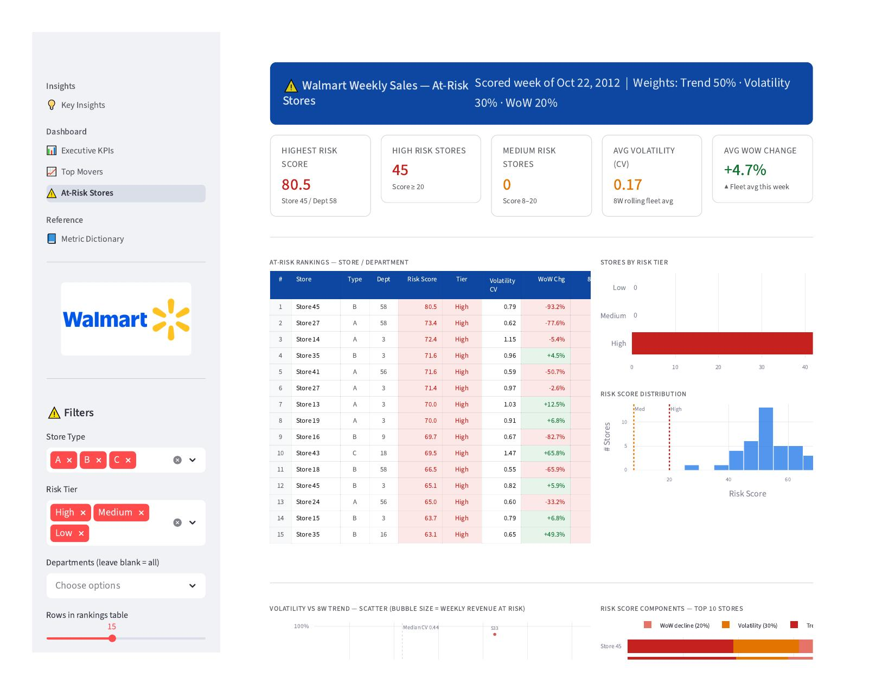
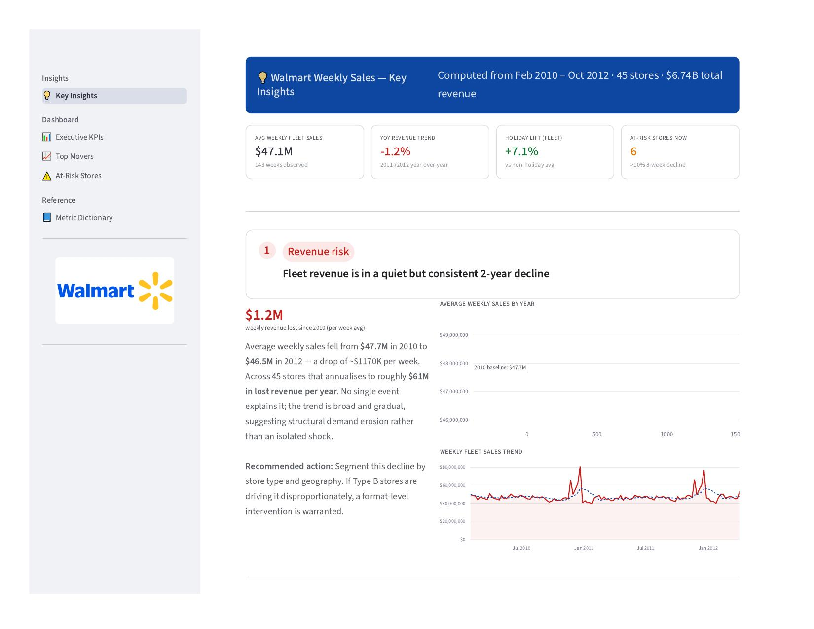
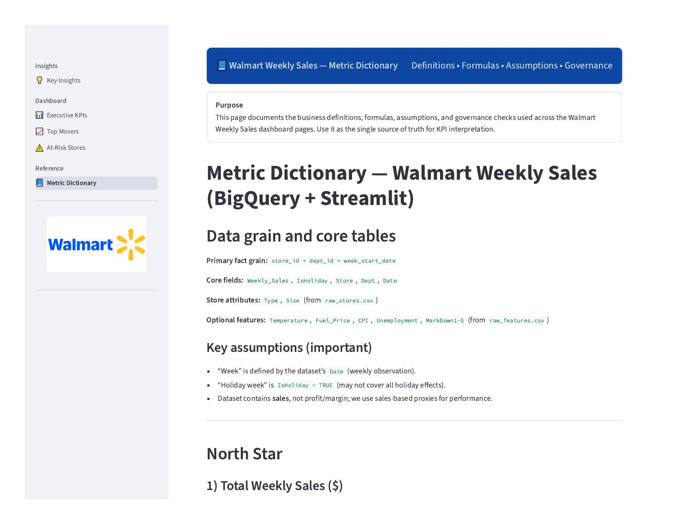

# 🛒 Walmart Weekly Sales Executive Dashboard

### KPI Framework + Executive Analytics | BigQuery + SQL + Streamlit + Plotly

A Business Intelligence project that transforms raw operational sales data into executive-ready insights, KPI governance, and proactive risk monitoring.

This project demonstrates a full BI workflow:

### Data Warehouse → SQL Modeling → KPI Views → Streamlit Dashboard

I first used **Google Cloud BigQuery** to build curated views and SQL logic for business metrics, then embedded those KPI queries into a **Streamlit** application for interactive executive dashboards.

---

## Live Dashboard
[Open the Interactive Dashboard](https://walmart-executive-dashboard.streamlit.app/)

---

# 📌 Business Objective

Executives don't need spreadsheets — they need decisions.

This dashboard helps leadership answer:

* How did we perform this week?
* What changed vs last week / last year?
* Which stores are outperforming or declining?
* Where should we intervene immediately?
* Are our KPIs trusted and clearly defined?

---

# 🧰 Tech Stack

| Tool                  | Purpose                           |
| --------------------- | --------------------------------- |
| Google Cloud BigQuery | Data warehouse + SQL metric layer |
| SQL                   | KPI logic + views + calculations  |
| Python                | Application logic                 |
| Streamlit             | Multi-page analytics app          |
| Plotly                | Interactive executive visuals     |
| Pandas                | Local data handling               |

---

# 🏗️ End-to-End Architecture

```text
Raw Walmart Data
      ↓
BigQuery Tables
      ↓
SQL Views / KPI Logic
      ↓
Python + Streamlit App
      ↓
Executive Dashboard Pages
```

---

# 📂 Project Structure

```text
Walmart-Dashboard/
│
├── app.py
├── metric_dictionary.md
├── Walmart-Logo.jpg
├── raw_sales.csv
├── raw_stores.csv
│
└── pages/
    ├── page1_executive_kpis.py
    ├── page2_top_movers.py
    ├── page3_at_risk.py
    ├── page4_metric_dictionary.py
    └── page5_insights.py
```

---

# 🧠 SQL / BigQuery Layer (Important)

Before building the dashboard UI, I designed the KPI logic in **BigQuery**.

That included creating reusable SQL views for:

### Executive Metrics

* Total Weekly Sales
* Active Stores
* Sales per Store
* WoW Growth %
* YoY Growth %
* Moving Average Sales

### Performance Drivers

* Top Movers
* Store Contribution
* Department Contribution
* Revenue Deltas

### Risk Modeling

* 8-week declining trends
* Revenue volatility
* Composite risk scores
* Store prioritization

### Seasonality

* Holiday lift %
* Holiday vs non-holiday performance

After validating the logic in SQL, those queries were integrated into the Streamlit app.

This mirrors real BI team workflows:
**warehouse first, dashboard second.**

---

# 🚀 Dashboard Pages

## 1️⃣ Executive KPIs

Leadership snapshot of weekly performance.

Includes:

* Total Weekly Sales
* Active Stores
* WoW Growth
* YoY Growth
* Holiday Lift
* Sales Trend
* Store Type Mix
* Volatility Index

Built in `page1_executive_kpis.py`



---

## 2️⃣ Top Movers

Explains what drove change.

Includes:

* Store rankings
* Top gainers / decliners
* Department contribution
* Department growth shifts
* Store trends

Built in `page2_top_movers.py`



---

## 3️⃣ At-Risk Stores

Prioritization dashboard using weighted risk logic.

Risk Formula:

```text
50% Trend Decline
30% Volatility
20% Recent WoW Drop
```

Built in `page3_at_risk.py`



---

## 4️⃣ Key Insights

Executive summary page with the 5 most important business findings, each backed by live data and a recommended action.

Includes:

* Fleet revenue trend analysis
* Store concentration risk
* Small store productivity paradox
* Post-holiday cliff analysis
* Department leverage and holiday sensitivity

Built in `page5_insights.py`



---

## 5️⃣ Metric Dictionary

Single source of truth for definitions and formulas.

Built in `page4_metric_dictionary.py`



---

# 📊 Key Business Insights from the Dashboard

## 📉 Fleet Revenue Is Quietly Declining

Average weekly sales fell from $47.7M (2010) to $46.5M (2012) — roughly **$61M annualised revenue erosion** with no single event to explain it.

### Action:
Segment the decline by store type. If Type B stores are driving it disproportionately, a format-level intervention is warranted.

---

## 🏬 Top 10 Stores Carry 39% of Total Revenue

The top 5 stores alone account for 21.5% of all fleet sales. The bottom 10 contribute just 8.6%.

### Action:
Create a "Flagship Watch" report monitoring the top 10 stores weekly at exec level, separate from the broader fleet review.

---

## 📐 Small Stores Are 38% More Productive Per Square Foot

Type C stores generate **$1,667/sqft** vs **$1,092/sqft** for large Type A stores — a counterintuitive finding that challenges a "bigger is better" expansion strategy.

### Action:
Run a net margin per sqft analysis including rent and labour before approving new large-format store openings.

---

## 📆 The Post-Holiday Cliff Is the Most Violent Revenue Event

Thanksgiving week spikes **+46% WoW**, then the week after Christmas crashes **−50%** — structurally, every year.

### Action:
Build explicit post-holiday markdown and clearance plans timed to the week of Dec 27. Prepare staff-down schedules 3 weeks in advance.

---

## 🏷️ Three Departments Drive 19 Cents of Every Dollar

Depts 92, 95, and 38 generated **$1.33B** over the full period. Dept 99 shows a **+303% holiday lift** — the strongest in the fleet.

### Action:
Prioritise fill-rate SLAs for the top 3 revenue depts year-round. Begin holiday inventory reviews for the top 5 holiday-sensitive departments 8 weeks before Thanksgiving.

---

## 📈 Holiday Weeks Create Revenue Lift

Holiday periods consistently outperform non-holiday weeks with a **+7.1% fleet-wide lift**.

### Action:
Increase labor scheduling, marketing spend, and inventory before holiday weeks.

---

## 📉 Volatility Predicts Future Risk

Stores with unstable revenue patterns appear more often in the At-Risk dashboard.

### Action:
Use volatility CV as an early warning KPI in weekly executive reviews.

---

## 🔻 Short-Term + Long-Term Decline = Highest Risk

Stores down this week and down over 8 weeks rank highest in risk scores.

### Action:
Prioritize intervention on structurally weak stores. Pull store manager reports for any store with a risk score above 50.

---

# 📌 Example Metrics

| Metric             | Definition                     |
| ------------------ | ------------------------------ |
| Total Weekly Sales | SUM(Weekly_Sales)              |
| WoW Growth         | Current Week vs Previous Week  |
| YoY Growth         | Same Week Prior Year           |
| Holiday Lift       | Holiday Avg vs Non-Holiday Avg |
| Volatility Index   | Std Dev ÷ Avg Sales            |
| Risk Score         | Weighted decline model         |

---

# 🧠 Skills Demonstrated

## Business Intelligence

Turning raw data into decisions.

## Data Warehousing

BigQuery modeling, reusable views, scalable SQL.

## Executive Storytelling

Dashboards built for leadership.

## Advanced Analytics

Risk scoring + anomaly prioritization.

## Product Thinking

Pages designed around stakeholder questions.

## Python Engineering

Reusable Streamlit architecture.

---

# ▶️ Run Locally

```bash
pip install streamlit pandas plotly numpy Pillow
streamlit run app.py
```

---

# 💼 Why This Project Stands Out

Many portfolios show charts.

This project demonstrates the full BI lifecycle:

* Build warehouse logic in BigQuery
* Define metrics in SQL
* Create reusable KPI views
* Deliver dashboards in Streamlit
* Surface insights for leadership

That is real Business Intelligence.

---

# 🔮 Future Enhancements

* Live BigQuery connection
* Looker Studio production version
* Real-time ETL pipeline
* Forecasting model
* Email alerts for risk stores
* Geographic store map

---

# 👤 About Me

Business Intelligence Analyst focused on:

* KPI Systems
* Executive Dashboards
* SQL + Python Automation
* Product / Operations Analytics
* Data Storytelling

---

# 📬 Let's Connect

Open to BI / Product Analyst / Analytics opportunities.
